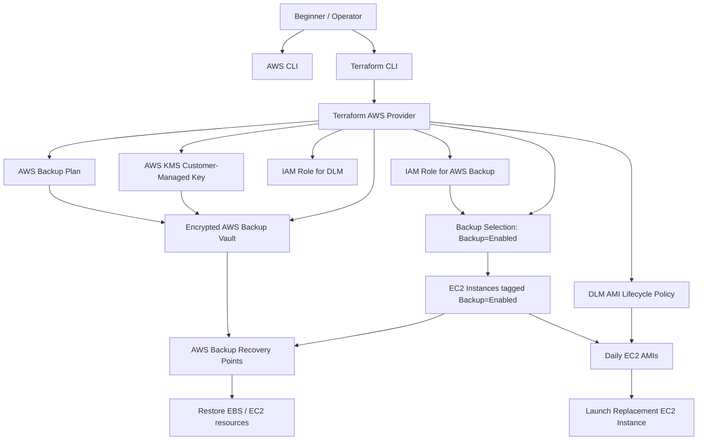

# Terraform Server Backup

A production oriented Terraform project that creates an encrypted AWS Backup solution for Amazon EC2 workloads and, optionally, scheduled Amazon Machine Images (AMIs) with Amazon Data Lifecycle Manager (DLM).

This README assumes you are starting from zero. It explains AWS, Terraform, credentials, permissions, deployment, verification, backup operations, restore operations, disaster recovery, and troubleshooting.

> **Important:** This project creates real AWS resources. Some resources may create charges, including AWS Backup storage, EBS snapshots, AMIs, KMS requests, and restore testing resources.

---

## Table of Contents

1. [Project Overview](#1-project-overview)
2. [Features](#2-features)
3. [Prerequisites](#3-prerequisites)
4. [AWS Account Requirements](#4-aws-account-requirements)
5. [AWS Credentials](#5-aws-credentials)
6. [Required AWS Permissions](#6-required-aws-permissions)
7. [Creating an IAM User](#7-creating-an-iam-user)
8. [Verify AWS Configuration](#8-verify-aws-configuration)
9. [Project Installation](#9-project-installation)
10. [Variables](#10-variables)
11. [tfvars](#11-tfvars)
12. [Backend Configuration](#12-backend-configuration)
13. [AWS Resources Created](#13-aws-resources-created)
14. [Running the Project](#14-running-the-project)
15. [AWS Backup](#15-aws-backup)
16. [Disaster Recovery](#16-disaster-recovery)
17. [Restore Procedures](#17-restore-procedures)
18. [AWS CLI Commands](#18-aws-cli-commands)
19. [Troubleshooting](#19-troubleshooting)
20. [FAQ](#20-faq)
21. [Best Practices](#21-best-practices)
22. [References](#22-references)

---

## 1. Project Overview

### What this project does

This repository uses [Terraform](https://developer.hashicorp.com/terraform) to deploy AWS infrastructure that protects EC2 servers with scheduled backups. It creates:

- A customer-managed AWS KMS key for encryption.
- An encrypted AWS Backup vault.
- An AWS Backup plan with daily, weekly, and monthly schedules.
- AWS Backup selections for EC2 instances tagged `Backup=Enabled`.
- An optional direct EC2 instance ARN selection.
- IAM roles that AWS Backup and DLM can assume.
- An optional DLM policy that creates daily EC2 AMIs.
- Terraform outputs that help operators find vaults, plans, roles, keys, and DLM policies.

### Why AWS Backup is used

AWS Backup is a managed AWS service for creating, storing, and restoring backups. For beginners, this means AWS handles much of the backup orchestration for you. This project uses AWS Backup because it provides:

- Centralized backup plans.
- Scheduled recovery points.
- Backup vaults.
- Retention policies.
- Encryption support.
- Restore jobs.
- Audit-friendly metadata and tagging.

AWS Backup is the primary recovery-point system in this project.

### Why AMIs are created

An Amazon Machine Image, or AMI, is a reusable image of an EC2 instance. You can launch a new EC2 instance from an AMI when you need fast replacement of a broken or deleted server.

This project can create daily AMIs with DLM when `enable_dlm_ami_backups = true`. AMIs are useful because they can reduce recovery time. Instead of manually rebuilding an instance from volumes and configuration, you can launch a new instance from a recent AMI.

### Disaster Recovery strategy

This project uses a two-layer recovery strategy:

1. **AWS Backup recovery points:** Primary point-in-time backups with daily, weekly, and monthly retention.
2. **DLM AMIs:** Optional fast-launch images for EC2 instance recovery.

A typical recovery decision looks like this:

| Incident | Recommended recovery path |
| --- | --- |
| Accidental file deletion | Restore from an AWS Backup recovery point or restored EBS volume. |
| Corrupted EBS volume | Restore the affected volume from AWS Backup. |
| Deleted EC2 instance | Launch from a recent AMI, or restore using AWS Backup. |
| Failed application deployment | Roll back by launching a previous AMI or restoring data. |
| Ransomware or compromise | Isolate affected systems, select a clean recovery point, restore into a controlled environment, validate, then cut over. |
| Availability Zone failure | Launch or restore in another Availability Zone in the same Region. |
| Region failure | This project is cross-region ready in design but does not currently create cross-region backup copies. Add AWS Backup copy actions or a second deployment for full regional disaster recovery. |

### Production use case

Use this project when you operate EC2 servers and need repeatable backup infrastructure managed as code. Example workloads include:

- Web servers.
- Application servers.
- Self-managed databases.
- Internal tools.
- Legacy applications running on EC2.
- Small production systems that need scheduled recovery points and AMI-based recovery.

For mission-critical systems, test restores regularly and consider adding cross-region copies, vault lock, monitoring, and application-aware backup procedures.

### Architecture overview



### High-level workflow

1. Create or choose an AWS account.
2. Create an IAM user or role with the required permissions.
3. Install Terraform and AWS CLI.
4. Configure AWS credentials locally.
5. Clone this repository.
6. Create a `terraform.tfvars` file.
7. Run `terraform init` to download providers.
8. Run `terraform validate` and `terraform plan` to check the configuration.
9. Run `terraform apply` to create the backup infrastructure.
10. Tag EC2 instances with `Backup=Enabled`.
11. Wait for scheduled backups or start manual backup jobs.
12. Verify recovery points and AMIs.
13. Practice restores before an emergency.

---

## 2. Features

- **Automated AWS Backup:** Creates an AWS Backup plan with daily, weekly, and monthly rules.
- **Scheduled EBS backups:** AWS Backup creates recovery points for selected EC2 resources and their supported volumes.
- **Scheduled EC2 AMIs:** Optional DLM policy creates daily AMIs for instances tagged `Backup=Enabled`.
- **KMS encryption:** Creates a customer-managed KMS key for the backup vault.
- **Backup vault:** Stores recovery points in an encrypted vault named after your project.
- **Lifecycle policies:** Daily, weekly, monthly, and AMI retention settings are configurable.
- **Disaster recovery:** Supports restore workflows from AWS Backup recovery points and AMIs.
- **Cross-region readiness:** The configuration can be extended for cross-region copies, but cross-region copy actions are not currently created by this repository.
- **Infrastructure as Code:** All supported resources are declared in Terraform.
- **Terraform root module:** The repository can be used directly or adapted as a root module.
- **Automatic tagging:** Provider-level default tags apply project, environment, managed-by, and backup metadata.
- **Tag-based selection:** EC2 instances are protected when they have `Backup=Enabled`.
- **Optional explicit EC2 selection:** You can pass `instance_arn` to protect one specific EC2 instance ARN.
- **Defensive validation:** Variables validate common mistakes before AWS API calls are made.
- **Safe KMS lifecycle:** The KMS key has `prevent_destroy` to reduce accidental loss of backup decryptability.
- **Operational outputs:** Outputs expose vault name, plan IDs, IAM role ARN, KMS key ARN, and DLM policy ID.

---

## 3. Prerequisites

### Operating Systems Supported

You can use this project from any workstation that can run Terraform and AWS CLI:

| Operating system | Supported | Notes |
| --- | --- | --- |
| Windows 10/11 | Yes | PowerShell examples are included where useful. |
| Linux | Yes | Ubuntu, Debian, RHEL, Rocky Linux, AlmaLinux, Amazon Linux, Fedora, and Arch Linux are supported. |
| macOS | Yes | Homebrew is the easiest installation method. |

### Terraform Installation

#### What Terraform is

Terraform is an Infrastructure as Code tool. Instead of creating AWS resources manually in the AWS Console, you describe them in `.tf` files. Terraform reads those files and calls AWS APIs to create, update, or delete resources.

#### Why Terraform is required

This repository is written in Terraform. You need the Terraform CLI to:

- Download the AWS provider.
- Validate the configuration.
- Preview changes.
- Apply the infrastructure.
- Store resource state.

#### Minimum supported version

This project requires Terraform `>= 1.9.0`.

#### Latest recommended version

Use the latest stable Terraform 1.x release available from HashiCorp unless your organization requires a pinned version. Newer patch releases include bug fixes and provider compatibility improvements.

#### Install Terraform on Ubuntu or Debian

The commands below install Terraform from HashiCorp's official APT repository.

```bash
sudo apt-get update
sudo apt-get install -y gnupg software-properties-common curl
curl -fsSL https://apt.releases.hashicorp.com/gpg | sudo gpg --dearmor -o /usr/share/keyrings/hashicorp-archive-keyring.gpg
echo "deb [signed-by=/usr/share/keyrings/hashicorp-archive-keyring.gpg] https://apt.releases.hashicorp.com $(. /etc/os-release && echo "$VERSION_CODENAME") main" | sudo tee /etc/apt/sources.list.d/hashicorp.list
sudo apt-get update
sudo apt-get install -y terraform
```

Expected result: the commands complete without errors and the `terraform` command becomes available.

#### Install Terraform on RHEL, Rocky Linux, AlmaLinux, Amazon Linux, or Fedora

Use the HashiCorp RPM repository. On Fedora, replace `dnf config-manager --add-repo` with the equivalent command supported by your version if needed.

```bash
sudo dnf install -y dnf-plugins-core
sudo dnf config-manager --add-repo https://rpm.releases.hashicorp.com/RHEL/hashicorp.repo
sudo dnf install -y terraform
```

For Amazon Linux 2 using `yum`:

```bash
sudo yum install -y yum-utils
sudo yum-config-manager --add-repo https://rpm.releases.hashicorp.com/AmazonLinux/hashicorp.repo
sudo yum install -y terraform
```

Expected result: Terraform is installed from the HashiCorp package repository.

#### Install Terraform on Arch Linux

```bash
sudo pacman -Syu terraform
```

Expected result: Pacman installs Terraform and its dependencies.

#### Install Terraform on macOS

Using Homebrew:

```bash
brew tap hashicorp/tap
brew install hashicorp/tap/terraform
```

Expected result: Terraform is installed under Homebrew's binary path.

#### Install Terraform on Windows

Recommended beginner method:

1. Open PowerShell as your normal user.
2. Install Chocolatey if your organization allows it, or download Terraform from HashiCorp releases.
3. With Chocolatey:

```powershell
choco install terraform -y
```

Alternative manual method:

1. Download the Windows ZIP file from HashiCorp releases.
2. Extract `terraform.exe` to a folder such as `C:\terraform`.
3. Add that folder to the Windows `Path` environment variable.
4. Open a new PowerShell window.

#### Verify Terraform installation

Run:

```bash
terraform version
```

Expected output looks similar to:

```text
Terraform v1.x.x
on linux_amd64
```

If you see `command not found`, close and reopen your terminal, verify your PATH, or reinstall Terraform.

### AWS CLI Installation

#### What AWS CLI is

The AWS Command Line Interface, or AWS CLI, is a terminal tool that lets you call AWS services from commands such as `aws sts get-caller-identity`.

#### Why this project needs it

Terraform creates the infrastructure, but AWS CLI is useful for:

- Configuring credentials.
- Verifying your identity.
- Listing backup vaults.
- Listing recovery points.
- Starting restore jobs.
- Describing EC2 instances, AMIs, and DLM policies.

#### AWS CLI vs Terraform

| Tool | Main purpose |
| --- | --- |
| Terraform | Defines and manages infrastructure state from `.tf` files. |
| AWS CLI | Runs direct operational commands against AWS APIs. |

You need both: Terraform for deployment and AWS CLI for setup, verification, and day-two operations.

#### Install AWS CLI on Ubuntu or Debian

```bash
sudo apt-get update
sudo apt-get install -y unzip curl
curl "https://awscli.amazonaws.com/awscli-exe-linux-x86_64.zip" -o "awscliv2.zip"
unzip awscliv2.zip
sudo ./aws/install
```

Expected result: AWS CLI v2 is installed.

#### Install AWS CLI on Amazon Linux, RHEL, Rocky Linux, AlmaLinux, or Fedora

```bash
sudo dnf install -y unzip curl
curl "https://awscli.amazonaws.com/awscli-exe-linux-x86_64.zip" -o "awscliv2.zip"
unzip awscliv2.zip
sudo ./aws/install
```

For Amazon Linux 2, use `sudo yum install -y unzip curl` if `dnf` is unavailable.

#### Install AWS CLI on macOS

Using Homebrew:

```bash
brew install awscli
```

Alternative: download and run the official macOS package installer from AWS.

#### Install AWS CLI on Windows

Recommended beginner method:

1. Download the AWS CLI MSI installer for Windows from AWS.
2. Run the installer.
3. Open a new PowerShell window.

Using Chocolatey:

```powershell
choco install awscli -y
```

#### Verify AWS CLI installation

Run:

```bash
aws --version
```

Expected output looks similar to:

```text
aws-cli/2.x.x Python/3.x.x Linux/...
```

If you see AWS CLI v1, upgrade to v2 unless your organization explicitly requires v1.

---

## 4. AWS Account Requirements

### What type of AWS account is required

You need an active AWS account where you are allowed to create IAM, KMS, AWS Backup, EC2, and DLM resources.

### AWS Free Tier

AWS Free Tier may reduce some costs for new accounts, but backups, snapshots, KMS keys, and restore tests can still create charges. Do not assume this project is free.

### AWS Accounts

An AWS account is a container for AWS resources, billing, users, roles, and security settings. Each account is isolated from other accounts unless you connect them using IAM roles, AWS Organizations, or networking.

### AWS Organizations

AWS Organizations lets companies manage multiple AWS accounts centrally. If your account belongs to an organization, Service Control Policies may block actions even when your IAM user appears to have permission.

### IAM Users

An IAM user is an identity in an AWS account. It can have console access, access keys, or both. Beginners commonly use an IAM user with access keys for local Terraform, but production teams often prefer SSO or short-lived roles.

### Root User

The root user is the original identity for the AWS account. It has full access to everything, including billing and account closure.

### Never use root credentials

Do not use root user access keys for Terraform. Root credentials must never be used because:

- They cannot be meaningfully restricted.
- Compromise can lead to total account takeover.
- They bypass least-privilege practices.
- They are not appropriate for automation.

Secure the root user with MFA and use IAM users, IAM Identity Center, or roles instead.

---

## 5. AWS Credentials

AWS credentials prove to AWS that your terminal is allowed to make API calls.

### Important credential terms

| Term | Meaning |
| --- | --- |
| Access Key ID | Public identifier for an IAM user's or role session's access key. It is not secret by itself. |
| Secret Access Key | Private secret paired with an access key ID. Treat it like a password. |
| Session Token | Temporary token used with short-lived role or SSO credentials. |
| AWS Profile | A named credential configuration, such as `default`, `dev`, or `prod`. |
| Environment Variables | Shell variables such as `AWS_ACCESS_KEY_ID` that tools can read. |
| Credential File | File containing access keys, usually `~/.aws/credentials`. |
| Shared Credentials File | Standard AWS file used by AWS CLI, Terraform AWS provider, and AWS SDKs. |
| Shared Config File | Standard AWS file for regions, output formats, SSO settings, and role profiles. |
| Credential Chain | The order AWS tools use to search for credentials. |

### Authentication methods

#### Method 1: `aws configure` with IAM user access keys

This is the simplest beginner method.

Run:

```bash
aws configure
```

AWS CLI asks four prompts:

```text
AWS Access Key ID [None]: AKIA...
AWS Secret Access Key [None]: your-secret-key
Default region name [None]: us-east-1
Default output format [None]: json
```

Explanation:

- **AWS Access Key ID:** Paste the access key ID from IAM.
- **AWS Secret Access Key:** Paste the secret access key. It is shown only once when created.
- **Default region name:** Use the same Region as `var.aws_region`, such as `us-east-1`.
- **Default output format:** Use `json` for scripts and examples.

Credentials are stored here:

| OS | Credentials file | Config file |
| --- | --- | --- |
| Linux | `~/.aws/credentials` | `~/.aws/config` |
| macOS | `~/.aws/credentials` | `~/.aws/config` |
| Windows | `%UserProfile%\.aws\credentials` | `%UserProfile%\.aws\config` |

Example credentials file:

```ini
[default]
aws_access_key_id = AKIAEXAMPLE
aws_secret_access_key = exampleSecretAccessKey
```

Example config file:

```ini
[default]
region = us-east-1
output = json
```

#### Method 2: Named AWS profiles

Profiles let you store multiple accounts or roles.

```bash
aws configure --profile backup-prod
```

Use the profile with AWS CLI:

```bash
aws sts get-caller-identity --profile backup-prod
```

Use the profile with Terraform by setting an environment variable:

```bash
export AWS_PROFILE=backup-prod
terraform plan
```

PowerShell:

```powershell
$env:AWS_PROFILE = "backup-prod"
terraform plan
```

#### Method 3: Environment variables

You can provide credentials directly through environment variables.

Linux and macOS:

```bash
export AWS_ACCESS_KEY_ID="AKIAEXAMPLE"
export AWS_SECRET_ACCESS_KEY="exampleSecretAccessKey"
export AWS_DEFAULT_REGION="us-east-1"
```

For temporary credentials, also set:

```bash
export AWS_SESSION_TOKEN="temporarySessionToken"
```

PowerShell:

```powershell
$env:AWS_ACCESS_KEY_ID = "AKIAEXAMPLE"
$env:AWS_SECRET_ACCESS_KEY = "exampleSecretAccessKey"
$env:AWS_DEFAULT_REGION = "us-east-1"
$env:AWS_SESSION_TOKEN = "temporarySessionToken"
```

Environment variables override many file-based settings. This is useful in CI/CD, but avoid pasting long-lived secrets into shared terminals.

#### Method 4: IAM Identity Center / AWS SSO

Many companies use AWS IAM Identity Center. Configure it with:

```bash
aws configure sso --profile backup-prod
aws sso login --profile backup-prod
export AWS_PROFILE=backup-prod
```

Terraform can use the same profile through the AWS provider credential chain.

#### Method 5: AssumeRole profiles

Advanced users can configure a profile that assumes an IAM role:

```ini
[profile backup-prod]
role_arn = arn:aws:iam::123456789012:role/TerraformBackupRole
source_profile = default
region = us-east-1
```

Then run:

```bash
AWS_PROFILE=backup-prod terraform plan
```

#### Method 6: EC2 instance profile or CI/CD role

If Terraform runs on an EC2 instance, GitHub Actions, GitLab CI, or another automation system, prefer short-lived role credentials instead of static access keys.

### How Terraform finds credentials

The Terraform AWS provider uses AWS SDK credential resolution. Common lookup order includes:

1. Environment variables.
2. Shared credentials file.
3. Shared config file profiles.
4. Web identity or OIDC role credentials.
5. SSO cached credentials.
6. EC2/ECS metadata credentials.

This means Terraform usually uses the same credentials as AWS CLI.

### `AWS_PROFILE`

`AWS_PROFILE` tells AWS CLI and Terraform which named profile to use.

```bash
export AWS_PROFILE=backup-prod
terraform apply
```

### `TF_VAR_` environment variables

Terraform variables can be set with environment variables prefixed by `TF_VAR_`.

```bash
export TF_VAR_aws_region="us-east-1"
export TF_VAR_project="production-api"
export TF_VAR_environment="prod"
terraform plan
```

Do not use `TF_VAR_` for long-lived AWS secret keys. Use AWS credential mechanisms instead.

---

## 6. Required AWS Permissions

Terraform needs permissions to create and read all resources in this repository. Missing permissions usually produce `AccessDenied`, `UnauthorizedOperation`, or `AccessDeniedException` errors.

### AWS API actions used by this Terraform project

| Area | API actions Terraform may call | Why needed |
| --- | --- | --- |
| STS | `sts:GetCallerIdentity` | Verify caller identity and account. |
| AWS Backup vaults | `backup:CreateBackupVault`, `backup:DescribeBackupVault`, `backup:ListBackupVaults`, `backup:TagResource`, `backup:UntagResource`, `backup:DeleteBackupVault` | Create, tag, read, and delete the encrypted backup vault. |
| AWS Backup plans | `backup:CreateBackupPlan`, `backup:GetBackupPlan`, `backup:UpdateBackupPlan`, `backup:DeleteBackupPlan`, `backup:ListBackupPlans`, `backup:TagResource`, `backup:UntagResource` | Manage daily, weekly, and monthly backup plan rules. |
| AWS Backup selections | `backup:CreateBackupSelection`, `backup:GetBackupSelection`, `backup:DeleteBackupSelection`, `backup:ListBackupSelections` | Select EC2 instances by tag or explicit ARN. |
| AWS Backup recovery and restore operations | `backup:ListRecoveryPointsByBackupVault`, `backup:DescribeRecoveryPoint`, `backup:StartRestoreJob`, `backup:DescribeRestoreJob`, `backup:ListRestoreJobs` | Operational verification and restore. |
| IAM roles | `iam:CreateRole`, `iam:GetRole`, `iam:DeleteRole`, `iam:UpdateAssumeRolePolicy`, `iam:TagRole`, `iam:UntagRole`, `iam:PassRole` | Create roles for AWS Backup and DLM; allow services to use them. |
| IAM policy attachments | `iam:AttachRolePolicy`, `iam:DetachRolePolicy`, `iam:ListAttachedRolePolicies` | Attach AWS-managed service-role policies. |
| KMS keys | `kms:CreateKey`, `kms:DescribeKey`, `kms:EnableKeyRotation`, `kms:GetKeyRotationStatus`, `kms:GetKeyPolicy`, `kms:PutKeyPolicy`, `kms:ListResourceTags`, `kms:TagResource`, `kms:UntagResource`, `kms:ScheduleKeyDeletion`, `kms:CreateAlias`, `kms:DeleteAlias`, `kms:UpdateAlias`, `kms:ListAliases` | Create and manage the customer-managed encryption key and alias. |
| KMS cryptographic use | `kms:Encrypt`, `kms:Decrypt`, `kms:ReEncrypt*`, `kms:GenerateDataKey*` | Required when services encrypt or decrypt backup data. |
| EC2 read | `ec2:DescribeInstances`, `ec2:DescribeVolumes`, `ec2:DescribeSnapshots`, `ec2:DescribeImages`, `ec2:DescribeRegions`, `ec2:DescribeAvailabilityZones`, `ec2:DescribeTags` | Discover and verify protected resources, snapshots, and AMIs. |
| EC2 restore operations | `ec2:RunInstances`, `ec2:CreateVolume`, `ec2:AttachVolume`, `ec2:DetachVolume`, `ec2:CreateTags` | Operational recovery from AMIs or restored volumes. |
| DLM | `dlm:CreateLifecyclePolicy`, `dlm:GetLifecyclePolicy`, `dlm:GetLifecyclePolicies`, `dlm:UpdateLifecyclePolicy`, `dlm:DeleteLifecyclePolicy`, `dlm:TagResource`, `dlm:UntagResource`, `dlm:ListTagsForResource` | Create and manage the optional daily AMI policy. |
| CloudWatch / Events | `events:DescribeRule`, `events:ListTargetsByRule`, `cloudwatch:GetMetricData`, `cloudwatch:ListMetrics` | Optional monitoring and troubleshooting of backup and DLM events. |
| Tagging | `tag:GetResources`, `tag:GetTagKeys`, `tag:GetTagValues` | Audit resource tags and backup coverage. |

### Production-ready IAM policy for the Terraform operator

Replace `REGION` and `ACCOUNT_ID` with your values. This policy is intentionally practical for deployment and operations. For very strict environments, split deployment and restore duties into separate roles.

```json
{
  "Version": "2012-10-17",
  "Statement": [
    {
      "Sid": "ReadIdentityAndAccountContext",
      "Effect": "Allow",
      "Action": [
        "sts:GetCallerIdentity",
        "ec2:DescribeAvailabilityZones",
        "ec2:DescribeImages",
        "ec2:DescribeInstances",
        "ec2:DescribeRegions",
        "ec2:DescribeSnapshots",
        "ec2:DescribeTags",
        "ec2:DescribeVolumes",
        "backup:ListBackupPlans",
        "backup:ListBackupVaults",
        "backup:ListRecoveryPointsByBackupVault",
        "backup:ListRestoreJobs",
        "dlm:GetLifecyclePolicies",
        "tag:GetResources",
        "tag:GetTagKeys",
        "tag:GetTagValues",
        "cloudwatch:GetMetricData",
        "cloudwatch:ListMetrics",
        "events:DescribeRule",
        "events:ListTargetsByRule"
      ],
      "Resource": "*"
    },
    {
      "Sid": "ManageBackupResources",
      "Effect": "Allow",
      "Action": [
        "backup:CreateBackupVault",
        "backup:DeleteBackupVault",
        "backup:DescribeBackupVault",
        "backup:CreateBackupPlan",
        "backup:GetBackupPlan",
        "backup:UpdateBackupPlan",
        "backup:DeleteBackupPlan",
        "backup:CreateBackupSelection",
        "backup:GetBackupSelection",
        "backup:DeleteBackupSelection",
        "backup:ListBackupSelections",
        "backup:DescribeRecoveryPoint",
        "backup:StartRestoreJob",
        "backup:DescribeRestoreJob",
        "backup:TagResource",
        "backup:UntagResource"
      ],
      "Resource": "*"
    },
    {
      "Sid": "ManageServiceRolesForBackupAndDLM",
      "Effect": "Allow",
      "Action": [
        "iam:CreateRole",
        "iam:GetRole",
        "iam:DeleteRole",
        "iam:UpdateAssumeRolePolicy",
        "iam:TagRole",
        "iam:UntagRole",
        "iam:AttachRolePolicy",
        "iam:DetachRolePolicy",
        "iam:ListAttachedRolePolicies",
        "iam:PassRole"
      ],
      "Resource": [
        "arn:aws:iam::ACCOUNT_ID:role/*-backup-role",
        "arn:aws:iam::ACCOUNT_ID:role/*-dlm"
      ]
    },
    {
      "Sid": "AllowAttachRequiredAWSManagedPolicies",
      "Effect": "Allow",
      "Action": [
        "iam:AttachRolePolicy",
        "iam:DetachRolePolicy"
      ],
      "Resource": [
        "arn:aws:iam::ACCOUNT_ID:role/*-backup-role",
        "arn:aws:iam::ACCOUNT_ID:role/*-dlm"
      ],
      "Condition": {
        "ArnEquals": {
          "iam:PolicyARN": [
            "arn:aws:iam::aws:policy/service-role/AWSBackupServiceRolePolicyForBackup",
            "arn:aws:iam::aws:policy/service-role/AWSBackupServiceRolePolicyForRestores",
            "arn:aws:iam::aws:policy/service-role/AWSDataLifecycleManagerServiceRole"
          ]
        }
      }
    },
    {
      "Sid": "ManageBackupKMSKey",
      "Effect": "Allow",
      "Action": [
        "kms:CreateKey",
        "kms:DescribeKey",
        "kms:EnableKeyRotation",
        "kms:GetKeyRotationStatus",
        "kms:GetKeyPolicy",
        "kms:PutKeyPolicy",
        "kms:ListResourceTags",
        "kms:TagResource",
        "kms:UntagResource",
        "kms:ScheduleKeyDeletion",
        "kms:CreateAlias",
        "kms:DeleteAlias",
        "kms:UpdateAlias",
        "kms:ListAliases",
        "kms:Encrypt",
        "kms:Decrypt",
        "kms:ReEncrypt*",
        "kms:GenerateDataKey*"
      ],
      "Resource": "*"
    },
    {
      "Sid": "ManageDLMPolicy",
      "Effect": "Allow",
      "Action": [
        "dlm:CreateLifecyclePolicy",
        "dlm:GetLifecyclePolicy",
        "dlm:UpdateLifecyclePolicy",
        "dlm:DeleteLifecyclePolicy",
        "dlm:TagResource",
        "dlm:UntagResource",
        "dlm:ListTagsForResource"
      ],
      "Resource": "*"
    },
    {
      "Sid": "RestoreEC2Operations",
      "Effect": "Allow",
      "Action": [
        "ec2:RunInstances",
        "ec2:CreateVolume",
        "ec2:AttachVolume",
        "ec2:DetachVolume",
        "ec2:CreateTags"
      ],
      "Resource": "*"
    }
  ]
}
```

### Least privilege recommendations

- Replace wildcard resources with project-specific ARNs where AWS supports them.
- Separate deploy permissions from restore permissions.
- Restrict `iam:PassRole` to AWS Backup and DLM service roles.
- Use IAM Identity Center or role assumption instead of long-lived access keys.
- Use MFA for human users.
- Add conditions based on `aws:RequestedRegion`, resource tags, or principal tags when possible.
- Review AWS-managed policies before using this in regulated environments.

### Common permission failures

| Error | Common cause | Fix |
| --- | --- | --- |
| `AccessDeniedException: User is not authorized to perform backup:CreateBackupVault` | Missing AWS Backup permissions. | Add backup vault permissions. |
| `AccessDenied: iam:CreateRole` | Caller cannot create IAM roles. | Ask an administrator to grant IAM role creation or pre-create roles. |
| `AccessDenied: iam:PassRole` | Caller cannot let AWS Backup or DLM use a role. | Grant `iam:PassRole` on the created service roles. |
| `UnauthorizedOperation: ec2:DescribeInstances` | Caller lacks EC2 read permissions. | Add EC2 describe permissions. |
| `AccessDeniedException: kms:CreateKey` | Caller cannot create KMS keys. | Grant KMS key management permissions. |
| `KMSInvalidStateException` | KMS key is disabled or pending deletion. | Re-enable the key or use a valid key. |

Troubleshooting steps:

1. Run `aws sts get-caller-identity` to confirm which identity Terraform is using.
2. Confirm the same profile is used by Terraform with `echo $AWS_PROFILE`.
3. Read the exact action in the error message.
4. Add only that required permission if it is appropriate.
5. Check AWS Organizations Service Control Policies if permissions look correct but still fail.

---

## 7. Creating an IAM User

> Production teams should prefer IAM Identity Center or short-lived roles. This IAM user workflow is included for beginners and learning environments.

### Step-by-step console guide

1. Sign in to the AWS Console as an administrator, not as the root user for daily work.
2. Open **IAM**.
3. Choose **Users**.
4. Choose **Create user**.
5. Enter a username such as `terraform-backup-operator`.
6. If you need console access, enable it according to your organization policy. For Terraform only, access keys are enough.
7. Choose **Next**.
8. Choose **Attach policies directly**.
9. Create or attach a policy based on [Required AWS Permissions](#6-required-aws-permissions).
10. Choose **Create user**.
11. Open the new user.
12. Choose **Security credentials**.
13. Choose **Create access key**.
14. Select the use case closest to **Command Line Interface**.
15. Confirm you understand the security recommendation.
16. Create the access key.
17. Download the `.csv` file or copy the access key ID and secret access key immediately.

Screenshot placeholders for maintainers:

- `[Screenshot: IAM Users page with Create user button]`
- `[Screenshot: IAM Create user name step]`
- `[Screenshot: IAM Attach policies directly step]`
- `[Screenshot: IAM Security credentials tab]`
- `[Screenshot: IAM Create access key CLI use case]`

### Configure AWS CLI

Run:

```bash
aws configure --profile backup-prod
```

Enter:

```text
AWS Access Key ID [None]: your-access-key-id
AWS Secret Access Key [None]: your-secret-access-key
Default region name [None]: us-east-1
Default output format [None]: json
```

### Verify identity

Run:

```bash
aws sts get-caller-identity --profile backup-prod
```

Expected output:

```json
{
  "UserId": "AIDA...",
  "Account": "123456789012",
  "Arn": "arn:aws:iam::123456789012:user/terraform-backup-operator"
}
```

If the account number or ARN is not what you expected, stop and fix credentials before running Terraform.

---

## 8. Verify AWS Configuration

Run each command before deployment.

### Show credential configuration

```bash
aws configure list --profile backup-prod
```

Expected output shows the profile, access key source, and Region. The secret key is masked.

### Confirm caller identity

```bash
aws sts get-caller-identity --profile backup-prod
```

Expected output includes `Account` and `Arn`.

### Confirm EC2 API access

```bash
aws ec2 describe-instances --profile backup-prod --region us-east-1
```

Expected output is JSON with `Reservations`. An empty list is okay if you have no instances.

### Confirm AWS Backup API access

```bash
aws backup list-backup-vaults --profile backup-prod --region us-east-1
```

Expected output is JSON with `BackupVaultList`. An empty list is okay.

### Troubleshooting verification

- `Unable to locate credentials`: run `aws configure --profile backup-prod`.
- `InvalidClientTokenId`: access key is wrong, deleted, or from a different partition.
- `ExpiredToken`: refresh SSO or temporary credentials.
- `AccessDenied`: add the missing permission or check organization restrictions.
- Region mismatch: use the same Region in CLI commands and `terraform.tfvars`.

---

## 9. Project Installation

### Clone repository

```bash
git clone <REPOSITORY_URL>
cd terraform-server-backup
```

Expected result: your terminal is inside the repository directory containing `README.md`, `variables.tf`, and other Terraform files.

### Repository structure

| File | Purpose |
| --- | --- |
| `providers.tf` | Terraform version and AWS provider configuration. |
| `variables.tf` | All user-configurable inputs and validation rules. |
| `tags.tf` | Common tags and backup selection tag contract. |
| `kms.tf` | Customer-managed KMS key and alias. |
| `iam.tf` | AWS Backup and optional DLM IAM service roles. |
| `backup.tf` | AWS Backup vault, plan, and selections. |
| `dlm.tf` | Optional DLM lifecycle policy for daily AMIs. |
| `outputs.tf` | Values printed after apply for operations and automation. |
| `terraform.tfvars.example` | Example variable file. Review carefully because your real values may differ. |
| `VARIABLE_REFERENCE.md` | Short pointer to variable definitions. |
| `OUTPUT_REFERENCE.md` | Short pointer to output definitions. |

### Create your variable file

Create `terraform.tfvars`:

```hcl
aws_region  = "us-east-1"
project     = "production-api"
environment = "prod"

# Optional: directly protect one EC2 instance by ARN.
# instance_arn = "arn:aws:ec2:us-east-1:123456789012:instance/i-0123456789abcdef0"

backup_start_cron      = "cron(0 2 * * ? *)"
daily_retention_days   = 35
weekly_retention_days  = 90
monthly_retention_days = 365

enable_dlm_ami_backups = true
ami_retention_count    = 14

additional_tags = {
  Owner      = "platform"
  CostCenter = "1234"
}
```

### Initialize Terraform

`terraform init` downloads the AWS provider and prepares the working directory.

```bash
terraform init
```

Expected output includes `Terraform has been successfully initialized!`.

### Format Terraform files

`terraform fmt` makes Terraform files use standard formatting.

```bash
terraform fmt -recursive
```

Expected output is empty if files were already formatted, or it prints filenames it changed.

### Validate Terraform configuration

`terraform validate` checks syntax and internal consistency.

```bash
terraform validate
```

Expected output: `Success! The configuration is valid.`

### Preview changes

`terraform plan` shows what Terraform will create before making changes.

```bash
AWS_PROFILE=backup-prod terraform plan
```

Expected output lists resources such as `aws_kms_key.backup`, `aws_backup_vault.main`, and `aws_backup_plan.main` with a plan summary.

### Apply changes

`terraform apply` creates or updates AWS resources.

```bash
AWS_PROFILE=backup-prod terraform apply
```

Terraform asks for confirmation. Type `yes` only after reviewing the plan.

Expected output includes `Apply complete!` and output values.

---

## 10. Variables

Every variable is defined in `variables.tf`.

| Variable | Purpose | Type | Default | Required | Example | Allowed values | Security considerations |
| --- | --- | --- | --- | --- | --- | --- | --- |
| `aws_region` | AWS Region where backup resources are deployed. | `string` | None | Yes | `us-east-1` | Must look like an AWS Region, such as `us-east-1` or `us-gov-west-1`. | Avoid deploying to the wrong Region because backups are regional unless copy actions are configured. |
| `project` | Short project name used in names and tags. | `string` | None | Yes | `production-api` | 3-63 lowercase letters, numbers, and hyphens; must start and end with a letter or number. | Project names appear in AWS resource names and tags. Do not include secrets. |
| `environment` | Environment tag. | `string` | None | Yes | `prod` | `dev`, `test`, `staging`, `prod` | Use accurate values so backup policies and cost reports are clear. |
| `instance_arn` | Optional EC2 instance ARN for direct AWS Backup selection. | `string` | `null` | No | `arn:aws:ec2:us-east-1:123456789012:instance/i-0123456789abcdef0` | `null` or valid EC2 instance ARN. | ARNs expose account IDs and resource IDs; do not publish private infrastructure details. |
| `instance_id` | Deprecated compatibility input. Not used. | `string` | `null` | No | `i-0123456789abcdef0` | Any string or null, but ignored. | Do not rely on this variable for backup selection. |
| `backup_start_cron` | Daily AWS Backup cron expression in UTC. | `string` | `cron(0 2 * * ? *)` | No | `cron(0 2 * * ? *)` | Valid AWS Backup cron expression. | Schedule backups outside busy write periods when possible. |
| `daily_retention_days` | Retention for daily recovery points. | `number` | `35` | No | `35` | AWS Backup retention-compatible positive number. | Higher retention usually increases storage cost. |
| `weekly_retention_days` | Retention for weekly recovery points. | `number` | `90` | No | `90` | Should be greater than daily retention. | Longer retention improves recovery options but increases cost. |
| `monthly_retention_days` | Retention for monthly recovery points. | `number` | `365` | No | `365` | Should be greater than weekly retention. | Long retention may be required for compliance but increases cost. |
| `enable_dlm_ami_backups` | Whether to create the DLM daily AMI policy. | `bool` | `true` | No | `true` | `true` or `false` | AMIs and backing snapshots can increase cost. |
| `ami_retention_count` | Number of DLM-created AMIs retained per instance. | `number` | `14` | No | `14` | Positive integer expected by DLM. | Higher counts increase snapshot storage cost. |
| `additional_tags` | Extra tags merged into taggable resources. | `map(string)` | `{}` | No | `{ Owner = "platform" }` | AWS-compatible tag keys and values. | Do not put secrets, passwords, tokens, or private customer data in tags. |

---

## 11. tfvars

### What is `terraform.tfvars`?

A `.tfvars` file supplies values for Terraform variables. Terraform automatically loads a file named `terraform.tfvars` in the current directory.

Example:

```hcl
aws_region  = "us-east-1"
project     = "production-api"
environment = "prod"
```

### `terraform.tfvars.example`

This file is an example. Copy it or use the examples in this README, then correct the variable names and values for the current module. Your real file should use `project`, not old names such as `project_name`.

### Environment-specific files

You can keep separate files:

- `development.tfvars`
- `staging.tfvars`
- `production.tfvars`

Run with:

```bash
terraform plan -var-file="production.tfvars"
terraform apply -var-file="production.tfvars"
```

### Passing variables other ways

CLI variable:

```bash
terraform plan -var="environment=prod"
```

Environment variable:

```bash
export TF_VAR_environment="prod"
terraform plan
```

### What should never be committed

Never commit:

- AWS access keys.
- Secret access keys.
- Session tokens.
- Private customer data.
- Passwords.
- Private account inventories.
- Sensitive ARNs if your organization treats them as confidential.
- `.terraform/` directories.
- Terraform state files such as `terraform.tfstate`.

---

## 12. Backend Configuration

### Terraform State

Terraform state records the mapping between Terraform resources and real AWS resources. Without state, Terraform cannot know what it manages.

### Local state

By default, Terraform stores state in `terraform.tfstate` on your machine. This is acceptable for learning but not recommended for production.

### Remote state

Remote state stores `terraform.tfstate` in a shared, protected backend. Production teams should use remote state so operators and CI/CD systems see the same infrastructure state.

### S3 backend

A common AWS backend uses S3 for state storage:

```hcl
terraform {
  backend "s3" {
    bucket  = "my-terraform-state-bucket"
    key     = "terraform-server-backup/prod.tfstate"
    region  = "us-east-1"
    encrypt = true
  }
}
```

### DynamoDB locking

Older Terraform S3 backend configurations often used DynamoDB for state locking. State locking prevents two users from applying changes at the same time. Concurrent applies can corrupt state or create conflicting infrastructure changes.

Example:

```hcl
terraform {
  backend "s3" {
    bucket         = "my-terraform-state-bucket"
    key            = "terraform-server-backup/prod.tfstate"
    region         = "us-east-1"
    encrypt        = true
    dynamodb_table = "terraform-locks"
  }
}
```

> Check your Terraform version and backend documentation because S3 locking options have evolved. The key idea is unchanged: production state must be encrypted, access-controlled, versioned, and locked.

---

## 13. AWS Resources Created

### `aws_kms_key.backup`

| Topic | Details |
| --- | --- |
| Purpose | Encrypt AWS Backup vault recovery points. |
| Inputs | `project` controls the description; default tags apply. |
| Outputs | `kms_key_arn`. |
| Cost | Monthly KMS key charge plus API request charges. |
| Security | Rotation is enabled. `prevent_destroy` reduces accidental deletion risk. |
| Dependencies | Used by `aws_backup_vault.main`. |
| Lifecycle | Created by Terraform; deletion is protected by Terraform lifecycle settings. |

### `aws_kms_alias.backup`

| Topic | Details |
| --- | --- |
| Purpose | Human-friendly alias `alias/<project>-backup` for the KMS key. |
| Inputs | `project`. |
| Outputs | Indirectly referenced through the KMS key output. |
| Cost | No separate alias charge. |
| Security | Do not reuse AWS-reserved `alias/aws/*` names. |
| Dependencies | Points to `aws_kms_key.backup`. |
| Lifecycle | Created, updated, or deleted by Terraform. |

### `aws_iam_role.backup`

| Topic | Details |
| --- | --- |
| Purpose | Allows AWS Backup to perform backup and restore operations. |
| Inputs | `project`. |
| Outputs | `backup_role_arn`. |
| Cost | IAM roles have no direct cost. |
| Security | Trust policy allows `backup.amazonaws.com` to assume the role. |
| Dependencies | Used by backup selections. |
| Lifecycle | Created and managed by Terraform. |

### `aws_iam_role_policy_attachment.backup`

| Topic | Details |
| --- | --- |
| Purpose | Attaches `AWSBackupServiceRolePolicyForBackup`. |
| Inputs | Backup role name. |
| Outputs | None directly. |
| Cost | No direct cost. |
| Security | AWS-managed policy should be reviewed for regulated environments. |
| Dependencies | Requires `aws_iam_role.backup`. |
| Lifecycle | Managed by Terraform. |

### `aws_iam_role_policy_attachment.restore`

| Topic | Details |
| --- | --- |
| Purpose | Attaches `AWSBackupServiceRolePolicyForRestores`. |
| Inputs | Backup role name. |
| Outputs | None directly. |
| Cost | No direct cost. |
| Security | Grants restore permissions needed by AWS Backup. |
| Dependencies | Requires `aws_iam_role.backup`. |
| Lifecycle | Managed by Terraform. |

### `aws_iam_role.dlm`

| Topic | Details |
| --- | --- |
| Purpose | Allows DLM to create and manage AMIs. |
| Inputs | `project`, `enable_dlm_ami_backups`. |
| Outputs | Used by the DLM lifecycle policy. |
| Cost | IAM roles have no direct cost. |
| Security | Trust policy allows `dlm.amazonaws.com` to assume the role. |
| Dependencies | Created only when DLM AMI backups are enabled. |
| Lifecycle | Managed by Terraform. |

### `aws_iam_role_policy_attachment.dlm`

| Topic | Details |
| --- | --- |
| Purpose | Attaches `AWSDataLifecycleManagerServiceRole`. |
| Inputs | DLM role name. |
| Outputs | None directly. |
| Cost | No direct cost. |
| Security | AWS-managed policy should be reviewed. |
| Dependencies | Requires `aws_iam_role.dlm`. |
| Lifecycle | Managed by Terraform. |

### `aws_backup_vault.main`

| Topic | Details |
| --- | --- |
| Purpose | Stores encrypted AWS Backup recovery points. |
| Inputs | `project`, KMS key ARN. |
| Outputs | `backup_vault_name`. |
| Cost | Backup storage cost based on recovery point size and retention. |
| Security | Encrypted with the customer-managed KMS key. |
| Dependencies | Requires KMS key. |
| Lifecycle | Managed by Terraform; recovery point contents may prevent deletion until cleaned up. |

### `aws_backup_plan.main`

| Topic | Details |
| --- | --- |
| Purpose | Defines daily, weekly, and monthly backup schedules. |
| Inputs | `backup_start_cron`, retention variables, tags. |
| Outputs | `backup_plan_name`, `backup_plan_id`. |
| Cost | Schedules create recovery points that incur storage cost. |
| Security | Recovery points receive tags for audit. |
| Dependencies | Uses backup vault. |
| Lifecycle | Managed by Terraform. |

### `aws_backup_selection.tagged_ec2`

| Topic | Details |
| --- | --- |
| Purpose | Selects resources tagged `Backup=Enabled`. |
| Inputs | Backup role ARN, backup plan ID, tag contract. |
| Outputs | None directly. |
| Cost | Selected resources produce backup storage cost. |
| Security | Incorrect tags may include or exclude resources. |
| Dependencies | Requires backup role and backup plan. |
| Lifecycle | Managed by Terraform. |

### `aws_backup_selection.explicit_ec2`

| Topic | Details |
| --- | --- |
| Purpose | Optionally selects one EC2 instance by ARN. |
| Inputs | `instance_arn`. |
| Outputs | None directly. |
| Cost | Backup storage for the explicit instance. |
| Security | Make sure the ARN belongs to the intended account and Region. |
| Dependencies | Created only when `instance_arn` is not null. |
| Lifecycle | Managed by Terraform. |

### `aws_dlm_lifecycle_policy.ami`

| Topic | Details |
| --- | --- |
| Purpose | Creates daily AMIs for instances tagged `Backup=Enabled`. |
| Inputs | `enable_dlm_ami_backups`, `ami_retention_count`, DLM role. |
| Outputs | `dlm_lifecycle_policy_id`. |
| Cost | AMIs use EBS snapshots, which incur snapshot storage charges. |
| Security | Tag-based discovery must be controlled carefully. |
| Dependencies | Requires DLM IAM role. |
| Lifecycle | Created only when DLM AMI backups are enabled. |

---

## 14. Running the Project

### `terraform init`

Initializes the directory and downloads providers.

```bash
terraform init
```

Expected output: Terraform reports successful initialization.

### `terraform validate`

Checks whether Terraform files are valid.

```bash
terraform validate
```

Expected output: `Success! The configuration is valid.`

### `terraform plan`

Shows what Terraform will do without changing AWS.

```bash
AWS_PROFILE=backup-prod terraform plan
```

Expected output: a list of resources to add, change, or destroy.

### `terraform apply`

Creates or updates resources.

```bash
AWS_PROFILE=backup-prod terraform apply
```

Expected output: Terraform asks for `yes`, then creates resources and prints outputs.

### `terraform destroy`

Deletes resources managed by this configuration.

```bash
AWS_PROFILE=backup-prod terraform destroy
```

Expected output: Terraform asks for `yes`, then deletes resources it can delete.

Important warnings:

- The KMS key has `prevent_destroy`, so Terraform will not destroy it unless you intentionally remove that guard.
- Backup vault deletion may fail if recovery points still exist.
- Destroying backup infrastructure can remove recovery capability.
- Never run destroy in production unless you have an approved retirement plan.

---

## 15. AWS Backup

### Backup Plans

A backup plan defines when backups run and how long recovery points are retained. This project creates one plan with three rules:

| Rule | Schedule | Retention |
| --- | --- | --- |
| Daily | `backup_start_cron`, default `cron(0 2 * * ? *)` | `daily_retention_days`, default 35 days |
| Weekly | Sundays at 03:00 UTC | `weekly_retention_days`, default 90 days |
| Monthly | First day of month at 04:00 UTC | `monthly_retention_days`, default 365 days |

### Backup Vault

A backup vault stores recovery points. This project creates one encrypted vault named `<project>-vault`.

### Recovery Points

A recovery point is one backup copy that can be restored. Recovery points are created by scheduled jobs or manual backup jobs.

### Retention and lifecycle

Retention controls when AWS Backup deletes old recovery points. Longer retention improves recovery options but increases cost.

### Encryption

Recovery points in the vault are encrypted with the customer-managed KMS key created by this project.

### Costs

Costs commonly include:

- AWS Backup warm storage.
- Restore charges where applicable.
- EBS snapshot storage.
- KMS key monthly charge and requests.
- Temporary EC2 instances and EBS volumes used during restore tests.

### Monitoring

Monitor:

- Backup job status.
- Restore job status.
- Recovery point age.
- Vault size and cost.
- KMS key state.
- CloudTrail events for role assumptions and destructive actions.

### Verify backups with AWS CLI

Get the vault name:

```bash
terraform output -raw backup_vault_name
```

List recovery points:

```bash
aws backup list-recovery-points-by-backup-vault \
  --backup-vault-name "$(terraform output -raw backup_vault_name)" \
  --region us-east-1 \
  --profile backup-prod
```

Expected output: JSON containing `RecoveryPoints`. If the list is empty, wait for a scheduled backup or confirm EC2 tags.

### Verify backups in the AWS Console

1. Open the AWS Console.
2. Go to **AWS Backup**.
3. Confirm you are in the correct Region.
4. Choose **Backup vaults**.
5. Open the vault named `<project>-vault`.
6. Review recovery points.
7. Check job history for successful jobs.

---

## 16. Disaster Recovery

### AMIs

AMIs allow you to launch replacement EC2 instances quickly. DLM creates AMIs every 24 hours at 02:30 UTC when enabled.

### Snapshots

EBS snapshots are point-in-time copies of EBS volumes. AMIs are backed by snapshots for EBS-backed instances.

### Recovery Points

AWS Backup recovery points are restorable backups in the vault.

### Restore Jobs

A restore job is an AWS Backup operation that restores data from a recovery point.

### Recovery scenarios

#### Accidental deletion

Restore the affected file, volume, or instance from a recent recovery point. If the whole instance was deleted, launch from AMI or restore through AWS Backup.

#### Corrupted server

Stop using the corrupted server. Restore a clean volume or launch a clean AMI. Validate before reconnecting to production traffic.

#### Ransomware

1. Isolate compromised instances.
2. Preserve forensic evidence if required.
3. Identify a recovery point from before compromise.
4. Restore into an isolated network.
5. Scan and validate.
6. Rotate credentials.
7. Cut over only after security approval.

#### Availability Zone failure

Launch a replacement instance in a healthy Availability Zone. Attach restored volumes if needed. Update load balancers and DNS.

#### Region failure

This repository does not currently configure cross-region backup copies. To recover from Region failure, you need one of these prepared before the outage:

- AWS Backup copy actions to another Region.
- AMI copy workflows to another Region.
- A second deployment in a standby Region.
- Replicated application data.

---

## 17. Restore Procedures

### Restore using AWS Console

1. Open **AWS Backup** in the correct Region.
2. Choose **Backup vaults**.
3. Open `<project>-vault`.
4. Select the recovery point.
5. Choose **Restore**.
6. Choose restore options such as instance type, VPC, subnet, security groups, IAM instance profile, or volume settings.
7. Start the restore job.
8. Open **Jobs** and monitor restore status.
9. When complete, verify the restored resource.
10. Update load balancer targets or DNS only after validation.

### Restore using AWS CLI

List recovery points:

```bash
aws backup list-recovery-points-by-backup-vault \
  --backup-vault-name "$(terraform output -raw backup_vault_name)" \
  --region us-east-1 \
  --profile backup-prod
```

Get restore metadata for a recovery point:

```bash
aws backup get-recovery-point-restore-metadata \
  --backup-vault-name "$(terraform output -raw backup_vault_name)" \
  --recovery-point-arn "RECOVERY_POINT_ARN" \
  --region us-east-1 \
  --profile backup-prod
```

Start a restore job after editing metadata for your environment:

```bash
aws backup start-restore-job \
  --recovery-point-arn "RECOVERY_POINT_ARN" \
  --iam-role-arn "$(terraform output -raw backup_role_arn)" \
  --metadata file://restore-metadata.json \
  --region us-east-1 \
  --profile backup-prod
```

Expected output includes a `RestoreJobId`.

Check restore status:

```bash
aws backup describe-restore-job \
  --restore-job-id "RESTORE_JOB_ID" \
  --region us-east-1 \
  --profile backup-prod
```

### Restore using Terraform

Terraform is not usually the tool that performs AWS Backup restore jobs. Use AWS Backup Console or AWS CLI for restores. Terraform can help after restore by managing DNS, load balancer target groups, security groups, and long-term infrastructure changes.

### Launch EC2 from AMI

List DLM-created AMIs:

```bash
aws ec2 describe-images \
  --owners self \
  --filters "Name=tag:Backup,Values=Enabled" \
  --region us-east-1 \
  --profile backup-prod
```

Launch an instance from an AMI:

```bash
aws ec2 run-instances \
  --image-id ami-0123456789abcdef0 \
  --instance-type t3.micro \
  --subnet-id subnet-0123456789abcdef0 \
  --security-group-ids sg-0123456789abcdef0 \
  --iam-instance-profile Name=my-instance-profile \
  --tag-specifications 'ResourceType=instance,Tags=[{Key=Name,Value=recovered-server},{Key=Backup,Value=Enabled}]' \
  --region us-east-1 \
  --profile backup-prod
```

Expected output includes the new `InstanceId`.

### Attach an EBS volume

Create a volume from a snapshot:

```bash
aws ec2 create-volume \
  --snapshot-id snap-0123456789abcdef0 \
  --availability-zone us-east-1a \
  --volume-type gp3 \
  --region us-east-1 \
  --profile backup-prod
```

Attach the volume:

```bash
aws ec2 attach-volume \
  --volume-id vol-0123456789abcdef0 \
  --instance-id i-0123456789abcdef0 \
  --device /dev/sdf \
  --region us-east-1 \
  --profile backup-prod
```

### Verify the application

After restore:

1. Log in to the instance.
2. Check operating system logs.
3. Check disk mounts.
4. Start required services.
5. Run application health checks.
6. Confirm data consistency.
7. Confirm security agents are running.
8. Confirm backups still apply by checking the `Backup=Enabled` tag.

### Update Load Balancer

If the old instance was behind an Application Load Balancer or Network Load Balancer:

1. Register the new instance in the target group.
2. Wait for health checks to pass.
3. Deregister the old instance.
4. Monitor error rates and latency.

### Update DNS

If clients connect directly by DNS:

1. Lower DNS TTL before planned recovery if possible.
2. Change the DNS record to the new load balancer or instance endpoint.
3. Verify propagation.
4. Monitor traffic.

### Rollback

If the restored instance fails validation:

1. Do not send production traffic to it.
2. Preserve logs for analysis.
3. Try an older recovery point or AMI.
4. Revert DNS or load balancer changes if already made.
5. Document the failed restore reason.

---

## 18. AWS CLI Commands

### Confirm identity

```bash
aws sts get-caller-identity --profile backup-prod
```

Shows the AWS account and identity used by AWS CLI.

### List EC2 instances

```bash
aws ec2 describe-instances --region us-east-1 --profile backup-prod
```

Shows EC2 instances in the Region. Use this to find instance IDs and tags.

### List backup vaults

```bash
aws backup list-backup-vaults --region us-east-1 --profile backup-prod
```

Shows AWS Backup vaults in the Region.

### List recovery points in the Terraform-created vault

```bash
aws backup list-recovery-points-by-backup-vault \
  --backup-vault-name "$(terraform output -raw backup_vault_name)" \
  --region us-east-1 \
  --profile backup-prod
```

Shows backups stored in the vault.

### Start a restore job

```bash
aws backup start-restore-job \
  --recovery-point-arn "RECOVERY_POINT_ARN" \
  --iam-role-arn "$(terraform output -raw backup_role_arn)" \
  --metadata file://restore-metadata.json \
  --region us-east-1 \
  --profile backup-prod
```

Starts a restore job from a recovery point.

### Describe AMIs owned by your account

```bash
aws ec2 describe-images --owners self --region us-east-1 --profile backup-prod
```

Shows AMIs you own, including DLM-created images.

### Launch EC2 from an AMI

```bash
aws ec2 run-instances \
  --image-id ami-0123456789abcdef0 \
  --instance-type t3.micro \
  --subnet-id subnet-0123456789abcdef0 \
  --security-group-ids sg-0123456789abcdef0 \
  --region us-east-1 \
  --profile backup-prod
```

Creates a new EC2 instance from the selected AMI.

### List DLM policies

```bash
aws dlm get-lifecycle-policies --region us-east-1 --profile backup-prod
```

Shows DLM lifecycle policies in the Region.

### Get one DLM policy

```bash
aws dlm get-lifecycle-policy \
  --policy-id "$(terraform output -raw dlm_lifecycle_policy_id)" \
  --region us-east-1 \
  --profile backup-prod
```

Shows details for the DLM policy created by Terraform.

---

## 19. Troubleshooting

| Problem | Symptom | Fix |
| --- | --- | --- |
| Terraform init errors | Provider download fails. | Check internet access, proxy settings, Terraform version, and provider constraints. |
| Missing credentials | `NoCredentialProviders` or `Unable to locate credentials`. | Run `aws configure`, set `AWS_PROFILE`, or configure SSO. |
| Wrong account | `aws sts get-caller-identity` shows unexpected account. | Change profile or credentials before applying. |
| `AccessDenied` | AWS rejects an action. | Add the missing IAM action, check permissions boundary, and check organization SCPs. |
| `InvalidClientTokenId` | AWS rejects the access key. | Recreate or correct access keys; confirm partition and account. |
| `ExpiredToken` | Temporary credentials expired. | Run `aws sso login` again or refresh role credentials. |
| Region mismatch | No instances or vaults appear. | Use the same Region in CLI, AWS Console, and `aws_region`. |
| KMS creation failure | Terraform fails on `aws_kms_key`. | Grant KMS permissions and check account KMS restrictions. |
| KMS decrypt failure | Restore cannot read encrypted backups. | Confirm key is enabled and the restore role can use it. |
| DLM policy missing | No DLM policy output or null output. | Confirm `enable_dlm_ami_backups = true`. |
| DLM AMIs missing | No new AMIs appear. | Confirm instances are tagged `Backup=Enabled`, DLM role exists, and DLM policy is enabled. |
| Backup jobs not running | No recovery points. | Confirm backup selection tag, Region, supported resource type, and backup job history. |
| Backup vault deletion fails | `InvalidRequestException` during destroy. | Delete recovery points only after confirming they are no longer needed. |
| Restore job fails | Restore job status is failed. | Inspect restore job message, metadata, IAM role, KMS key, subnet, security groups, and service quotas. |
| AMI launch fails | `InvalidAMIID.NotFound` or launch error. | Confirm AMI ID, Region, permissions, architecture, and instance type compatibility. |
| Terraform validation fails | Variable validation error. | Read the exact message and correct `terraform.tfvars`. |
| `project_name` not accepted | Terraform asks for `project`. | Use the current variable `project`; do not use outdated variable names. |

---

## 20. FAQ

1. **What is Terraform?** Terraform is a tool that creates and manages infrastructure from code files.
2. **What is AWS Backup?** AWS Backup is a managed AWS service for creating and restoring backups.
3. **What is an EC2 instance?** An EC2 instance is a virtual server in AWS.
4. **What is an EBS volume?** An EBS volume is block storage attached to an EC2 instance.
5. **What is an AMI?** An AMI is an image used to launch EC2 instances.
6. **What is DLM?** Amazon Data Lifecycle Manager automates snapshot and AMI lifecycles.
7. **What is KMS?** AWS Key Management Service manages encryption keys.
8. **Why does this project create a KMS key?** To encrypt backup vault recovery points with a customer-managed key.
9. **Can I use this without AWS CLI?** Terraform deployment can work without AWS CLI, but AWS CLI is strongly recommended for verification and restores.
10. **Can I use root credentials?** No. Use IAM users, IAM Identity Center, or roles.
11. **Will this back up every EC2 instance automatically?** It backs up EC2 instances selected by `Backup=Enabled` and optionally one explicit `instance_arn`.
12. **How do I tag an instance?** In the EC2 Console, select the instance, open Tags, and add `Backup` with value `Enabled`.
13. **Does this create EC2 instances?** No. It protects existing tagged EC2 instances.
14. **Does this create a VPC?** No. It only creates backup, IAM, KMS, and optional DLM resources.
15. **Does this support databases?** It protects supported EC2/EBS resources. Application-consistent database backups may need extra database-specific steps.
16. **Are backups encrypted?** Yes, the backup vault uses a customer-managed KMS key.
17. **Can I change retention?** Yes, update retention variables and run `terraform apply`.
18. **Can I disable AMIs?** Yes, set `enable_dlm_ami_backups = false`.
19. **Why do I see `AWSBackupOnly` tag on Terraform-created resources?** The local tag value changes when DLM is disabled so common resource tags do not imply DLM selection.
20. **Why must EC2 instances have `Backup=Enabled`?** AWS Backup and DLM use this tag for discovery.
21. **Can I restore to another Availability Zone?** Usually yes, choose restore settings in the target Availability Zone.
22. **Can I restore to another Region?** Only if you copied backups or AMIs to that Region before the failure.
23. **What happens if I delete the KMS key?** Encrypted backups may become unrecoverable. Do not delete it while recovery points exist.
24. **Can I run this in multiple accounts?** Yes, configure credentials for each account and use separate state.
25. **Can I run this in multiple Regions?** Yes, deploy separately per Region or extend the module.
26. **What is Terraform state?** State is Terraform's record of managed resources.
27. **Should I commit Terraform state?** No. Store it in a secure remote backend for production.
28. **What if `terraform plan` wants to destroy something?** Stop and understand why before applying.
29. **How do I estimate cost?** Review AWS Backup storage, EBS snapshot storage, KMS, and restore test resources in AWS Pricing Calculator.
30. **How often should I test restores?** Test at least quarterly for production, and after major architecture changes.
31. **Can I use this in CI/CD?** Yes, prefer OIDC or short-lived role credentials.
32. **Does this enforce AWS Backup Vault Lock?** No. Add vault lock separately if you need immutable backups.
33. **Does this protect against ransomware?** It helps, but you also need isolation, IAM hardening, monitoring, patching, and tested clean restore procedures.
34. **Why is my recovery point list empty?** The schedule may not have run yet, or the EC2 instance tag or Region may be wrong.
35. **Can I manually start a backup?** Yes, use AWS Backup Console or CLI with the correct resource ARN, vault, and role.

---

## 21. Best Practices

### AWS

- Use separate AWS accounts for development, staging, and production.
- Enable MFA for human users.
- Use CloudTrail in every account and Region.
- Monitor AWS Backup and restore job failures.
- Track backup cost with tags and budgets.

### Terraform

- Use remote encrypted state.
- Enable state locking.
- Review every `terraform plan` before applying.
- Pin provider versions with tested constraints.
- Do not edit state manually unless you fully understand the impact.
- Keep `terraform.tfvars` out of public repositories if it contains sensitive infrastructure details.

### IAM

- Do not use root credentials.
- Prefer short-lived credentials.
- Grant least privilege.
- Separate deploy, read-only, and restore permissions.
- Restrict `iam:PassRole`.
- Review AWS-managed policies for compliance.

### KMS

- Keep key rotation enabled.
- Do not delete keys used by backups.
- Monitor disabled or pending-deletion keys.
- Restrict key administration to trusted operators.

### Backups

- Tag all protected resources consistently.
- Test restores, not just backup creation.
- Use retention that matches business requirements.
- Consider AWS Backup Vault Lock for immutability.
- Consider cross-region copies for regional disaster recovery.

### Disaster Recovery

- Define Recovery Time Objective (RTO) and Recovery Point Objective (RPO).
- Document application-specific recovery steps.
- Practice recovery in a non-production environment.
- Keep DNS and load balancer cutover steps documented.
- Store runbooks somewhere available during outages.

### Security

- Never store secrets in Git.
- Encrypt Terraform state.
- Limit who can delete recovery points.
- Monitor CloudTrail for backup vault, KMS, IAM, and DLM changes.
- Use security groups and isolated subnets for restore testing.

### Tagging

- Use consistent tags such as `Project`, `Environment`, `Owner`, `CostCenter`, and `Backup`.
- Avoid sensitive information in tags.
- Audit for untagged EC2 instances.

### Cost Optimization

- Tune retention periods.
- Delete obsolete AMIs and snapshots only after confirming they are not needed.
- Use budgets and cost alerts.
- Review backup storage growth monthly.
- Disable DLM AMIs if AWS Backup recovery points meet your RTO.

---

## 22. References

Official documentation:

- Terraform Documentation: https://developer.hashicorp.com/terraform/docs
- Terraform AWS Provider: https://registry.terraform.io/providers/hashicorp/aws/latest/docs
- AWS Backup Documentation: https://docs.aws.amazon.com/aws-backup/
- AWS CLI Documentation: https://docs.aws.amazon.com/cli/
- AWS IAM Documentation: https://docs.aws.amazon.com/iam/
- AWS KMS Documentation: https://docs.aws.amazon.com/kms/
- Amazon Data Lifecycle Manager Documentation: https://docs.aws.amazon.com/AWSEC2/latest/UserGuide/snapshot-lifecycle.html
- Amazon EC2 Documentation: https://docs.aws.amazon.com/ec2/
- Amazon EBS Snapshots: https://docs.aws.amazon.com/ebs/latest/userguide/ebs-snapshots.html

---

## Contributing and License

See `CODE_OF_CONDUCT.md` and `LICENSE`.
