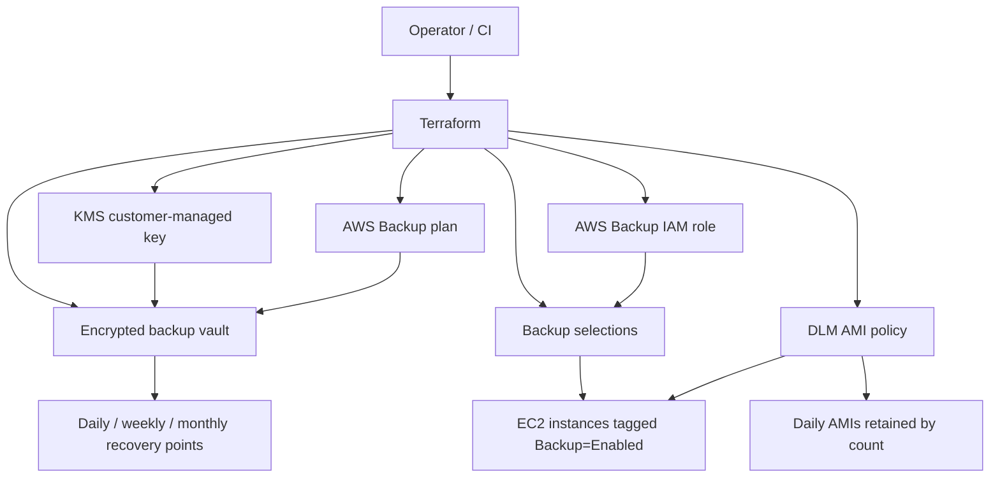

# Terraform Server Backup

Production-oriented Terraform for protecting EC2 workloads with encrypted AWS Backup recovery points and optional Amazon Data Lifecycle Manager (DLM) AMIs.

## Architecture



## Features

- Customer-managed KMS encryption for AWS Backup vault recovery points.
- Daily, weekly, and monthly AWS Backup schedules with configurable retention.
- Tag-based EC2 backup selection plus backward-compatible optional explicit instance ARN selection.
- Optional DLM daily AMI policy for rapid instance launch recovery.
- Provider default tags for consistent ownership, environment, and backup metadata.
- Defensive variable validation and documented outputs.

## AWS services used

AWS Backup, AWS KMS, IAM, Amazon EC2, EBS snapshots, and Amazon Data Lifecycle Manager.

## Requirements

- Terraform `>= 1.9.0`.
- AWS provider `>= 6.0.0, < 7.0.0`; HashiCorp Registry reported `6.54.0` as latest on July 17, 2026.
- AWS CLI v2 for operational restore commands.
- AWS credentials with permission to manage Backup, KMS, IAM, and DLM resources.

## Repository structure

| File | Purpose |
| --- | --- |
| `providers.tf` | Terraform and AWS provider constraints/configuration. |
| `variables.tf` | Public input interface and validation. |
| `tags.tf` | Common tags and backup tag contract. |
| `kms.tf` | Customer-managed backup KMS key and alias. |
| `iam.tf` | AWS Backup and optional DLM service roles. |
| `backup.tf` | Backup vault, plan, and selections. |
| `dlm.tf` | Optional daily AMI lifecycle policy. |
| `outputs.tf` | Operational outputs for restore and audit workflows. |

## Quick start

```hcl
aws_region  = "us-east-1"
project     = "production-api"
environment = "prod"

additional_tags = {
  Owner      = "platform"
  CostCenter = "1234"
}
```

Tag EC2 instances that should be protected:

```hcl
tags = {
  Name   = "production-api"
  Backup = "Enabled"
}
```

Deploy:

```bash
terraform init
terraform fmt -recursive
terraform validate
terraform plan
terraform apply
```

## Authentication

Use standard AWS provider authentication: environment variables, AWS SSO profiles, EC2 instance profiles, or CI/CD OIDC roles. Do not store AWS access keys in this repository.

## Remote backend

This root module intentionally does not hard-code a backend. For production, use an encrypted and access-controlled remote backend such as S3 with state locking or HCP Terraform. Example partial backend file:

```hcl
terraform {
  backend "s3" {
    bucket         = "my-terraform-state"
    key            = "terraform-server-backup/prod.tfstate"
    region         = "us-east-1"
    encrypt        = true
    dynamodb_table = "terraform-locks"
  }
}
```

## Variables and outputs

See `VARIABLE_REFERENCE.md` and `OUTPUT_REFERENCE.md` for the maintained contract.

## Backup strategy

AWS Backup creates encrypted recovery points in one vault on three schedules: daily, weekly, and monthly. DLM creates AMIs daily when enabled. AWS Backup is the primary recovery-point system; DLM AMIs optimize rapid EC2 relaunch scenarios.

## Disaster recovery and restore

1. Confirm the desired recovery point or AMI exists.
2. Restore from AWS Backup for point-in-time recovery or launch the latest DLM AMI for rapid recovery.
3. Reattach required networking, IAM instance profile, security groups, DNS, and load balancer targets.
4. Validate application health before shifting production traffic.

## Destroy

`terraform destroy` removes IAM roles, backup plans, selections, vault metadata, and DLM policies. The KMS key uses `prevent_destroy` to reduce accidental loss of recovery capability; remove this lifecycle guard only after confirming no required recovery points depend on the key.

## Security

- No hardcoded secrets are required or included.
- Backups are encrypted with a customer-managed KMS key and rotation enabled.
- IAM trust policies are service-principal scoped.
- Terraform state must be stored in an encrypted backend with least-privilege access.
- Review AWS-managed IAM policies for compliance-sensitive environments.

## Cost considerations

Costs come primarily from AWS Backup warm storage, EBS snapshots backing AMIs, KMS requests, and restore testing. Retention periods and AMI retention count directly influence cost.

## Logging and monitoring

Monitor AWS Backup jobs, DLM policy executions, KMS key state, and CloudTrail `AssumeRole` events. Configure CloudWatch/EventBridge alerts for failed backup, copy, and restore jobs.

## Troubleshooting

- No backups: verify `Backup=Enabled` is present on target EC2 instances and in the same Region.
- KMS errors: confirm AWS Backup can use the configured key and the key is enabled.
- DLM missing AMIs: confirm `enable_dlm_ami_backups = true` and the EC2 instance tag is exact.
- Terraform plan auth failures: run `aws sts get-caller-identity` with the same profile used by Terraform.

## Contributing and license

See `CONTRIBUTING.md`, `CODE_OF_CONDUCT.md`, `SECURITY.md`, and `LICENSE`.

## References

- AWS Backup documentation: https://docs.aws.amazon.com/aws-backup/
- Amazon DLM documentation: https://docs.aws.amazon.com/AWSEC2/latest/UserGuide/snapshot-lifecycle.html
- Terraform AWS provider documentation: https://registry.terraform.io/providers/hashicorp/aws/latest/docs
- Terraform language documentation: https://developer.hashicorp.com/terraform/language
